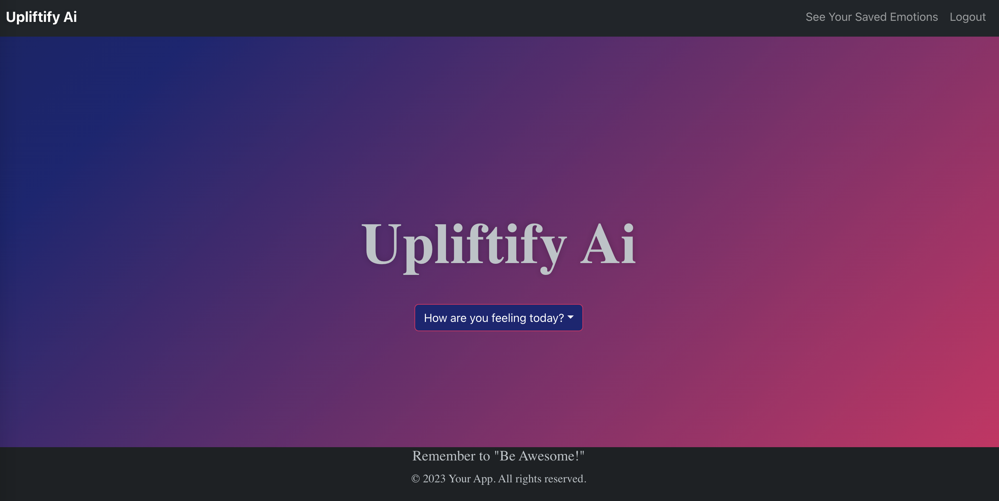
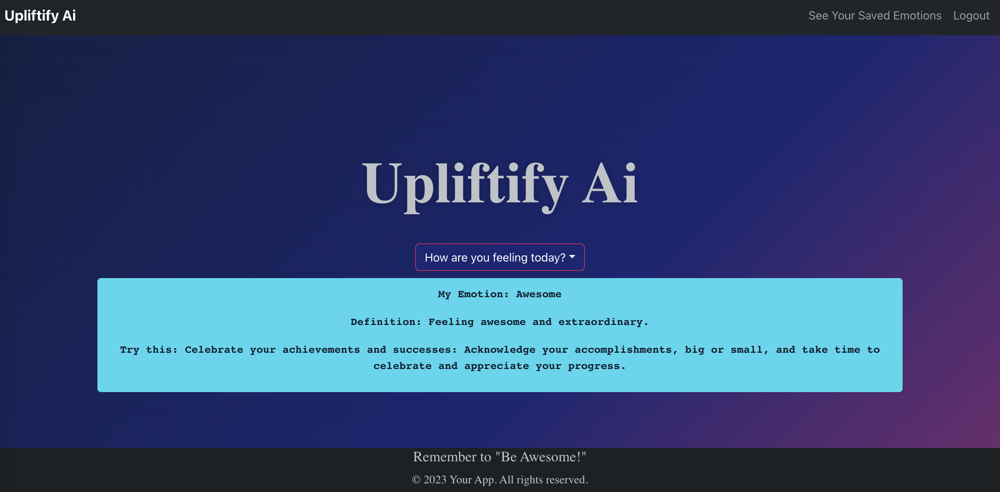

# Upliftify AI

___

## Description

___

The project is a user-centric platform constructed with the MERN-stack single-page application architecture. It leverages MongoDB as its backend, GraphQL API for efficient data querying and manipulation, and an Express.js and Node.js server for handling server-side operations. On the frontend, it employs React to deliver a seamless user interface, ensuring smooth and intuitive interaction.

One of its notable features is the incorporation of user authentication through JSON Web Tokens (JWT), guaranteeing secure access to user accounts while preventing unauthorized entry. This authentication mechanism enables users to create accounts, log in, and perform actions tailored to their specific permissions.

This is a still a work in progress and over time will incorporate our may ideas.  Stay Tuned!!

## Table of Contents

* [License](#license)
* [Installation](#installation)
* [Usage](#usage)
* [Contributors](#contributors)
* [Questions](#questions)
* [Credits](#credits)

## License

___

This project is covered under the MIT license. To learn more about what this means, click the license button at the top.

___

## Installation

To install and set up the React MERN Stack Application, follow these simple steps:

1. Make sure you have Node.js and npm (Node Package Manager) installed on your system.

1. Download or clone the project repository from the designated source.

1. Open a terminal or command prompt and navigate to the project directory.

1. Run the following command to install the required dependencies: `npm install`: This command will fetch and install all the necessary packages and libraries needed for the application to run smoothly.

1. After the installation is complete, run the following command to start the development server: `npm run develop`:
This command will initiate the server and compile the React components, allowing you to access and interact with the application in your browser.

Once the development server is up and running, open your web browser and visit the designated URL or localhost address where the application is being served.

Congratulations! You have successfully installed and launched the React MERN Stack Application `Upliftify AI`. You can now explore its features and functionalities. Enjoy!
___

## Usage

You can see `Upliftify AI` in action here 👉 : [Upliftify AI](https://young-fjord-87533.herokuapp.com/)

___

## Contributors

___

Created by:

* <a href="https://github.com/mynamebrogrammer"> Habib Maksoud </a>

* <a href="https://github.com/koshea1124"> Kevin O'Shea </a>    

* <a href="https://github.com/TyGosley"> Tyler Gosley</a>

## Questions

___

Have questions about this project?  Please reach out to us.

## Credits

___

[React](https://react.dev/)

[MongoDB](https://www.mongodb.com/)

[ApolloGraphQL](https://www.apollographql.com/docs/)

[dotenv](https://www.npmjs.com/package/dotenv)

[React BootStrap](https://react-bootstrap.github.io/)

[Font Awesome](https://fontawesome.com/icons)

[Node.JS](https://nodejs.org/en/docs)

[Express.JS](https://expressjs.com/en/guide/routing.html#express-router)

[Codecademy](https://www.codecademy.com/learn)

[Khan Academy](https://www.khanacademy.org/)

[MDN Docs](https://developer.mozilla.org/en-US/)

[W3Schools](https://www.w3schools.com/js/default.asp)

[JavaScript.info](https://javascript.info/)

[CodeHS](https://codehs.com/)